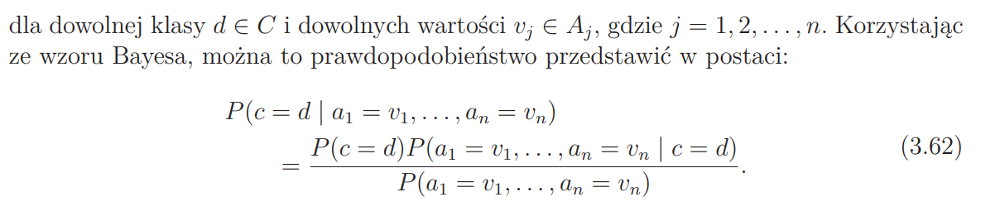
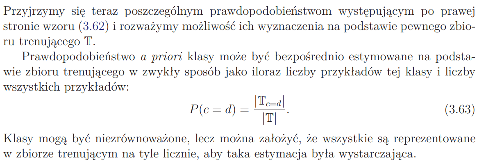

Podstawowe wiadomości przed wykonaniem zadania:

## Sieć Bayesa

Acykliczny graf, w którym:

- wierzchołki odpowiadają dyskretnym zmienny losowym
- krawędzie reprezentują bezpośrednio występujące zależności między tymi zmiennymi
- dla każdej zmiennej dany jest jej rozkład prawdopodobieństwa – warunkowy jeżeli do zmiennej prowadzą krawędzie
- strzałki: przyczyna -> skutek

## Naiwny klasyfikator Bayesowski

- jego zadaniem, podobnie jak w przypadku drzewa decyzjnego, jest przypisanie danych do określonej klasy na podstawie ich cech
- wykorzystuje wnioskowanie bayesowskie do predyckji prawdopodobieństwa klas

---

## Naiwność

- naiwność polega na tym, że zakładamy, że w ramach każdej klasy atrybuty są niezależne (w rzeczywistości jest to zazwyczaj niespełnione)

## Prawdopodobieństwo zerowe

- uzyskanie zerowej wartości któregokolwiek z prawdopodbieństw P(a=v|c=d) pociąga za sobą uznanie, że klasa d ma zerowe prawdopodobieństwo dla klasyfikowanego przykład, po to stosuje się tzw. wygładzenia, aby tego zerowego prawdopodobieństwa unikać
