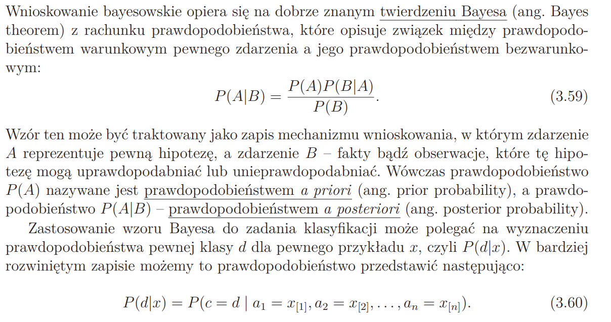

Podstawowe wiadomości przed wykonaniem zadania:

## Pomoce (dosłownie wszystko co jest potrzebne)

- https://www.youtube.com/watch?v=O2L2Uv9pdDA
- https://www.youtube.com/watch?v=H3EjCKtlVog

---

## Naiwny klasyfikator Bayesa

- jego zadaniem, podobnie jak w przypadku drzewa decyzjnego, jest przypisanie danych do określonej klasy na podstawie ich cech
- wykorzystuje wnioskowanie bayesowskie do predyckji prawdopodobieństwa klas
- opiera się na prawdopodobieństwie warunkowym - np. prawdopodobieństwo, że kwiatek ma długość łodygi z przedziału określonym numerem 2, pod warunkiem, że kwiatek ma klasę 1
- opiera też się na (priori) prawdopodobieństwie zajścia jakiegoś zdarzenia na podstawie zbioru trenującego - prawdopodobieństwo wystąpeiania klasy kwiataka 0, 1, 2 w naszym przypadku
- mamy problem jeśli w jakimś prawdopodobieństwie warunkowym mamy 0

## Naiwność

- naiwność polega na tym, że zakładamy, że w ramach każdej klasy atrybuty są niezależne (w rzeczywistości jest to zazwyczaj niespełnione)

## Naiwny gausowski klasyfikator Bayesa

- używa wartości ciągłych
- używa rozkładu normalnego dla rozkładu dla każdej cechy
- na początku także strzelamy, która klasa będzie ok, przechodząc przez wszystkie klasy
- dla pojedynczej wartości cechy nie znajdujemy prawdopodobieństwa warunkowego, ale gęstość prawdopodobieństwa patrząc na rozkład normalny
- i cały nasz iloczyn przepuszczamy przez logarytm aby uniknąć bardzo bardzo małych wartości loga(u\*v) = loga(u) + loga(v): na podstawie tych wyników patrzymy, która klasa jest bardziej prawdopodobna, która klasa ma większą obliczoną wartość
