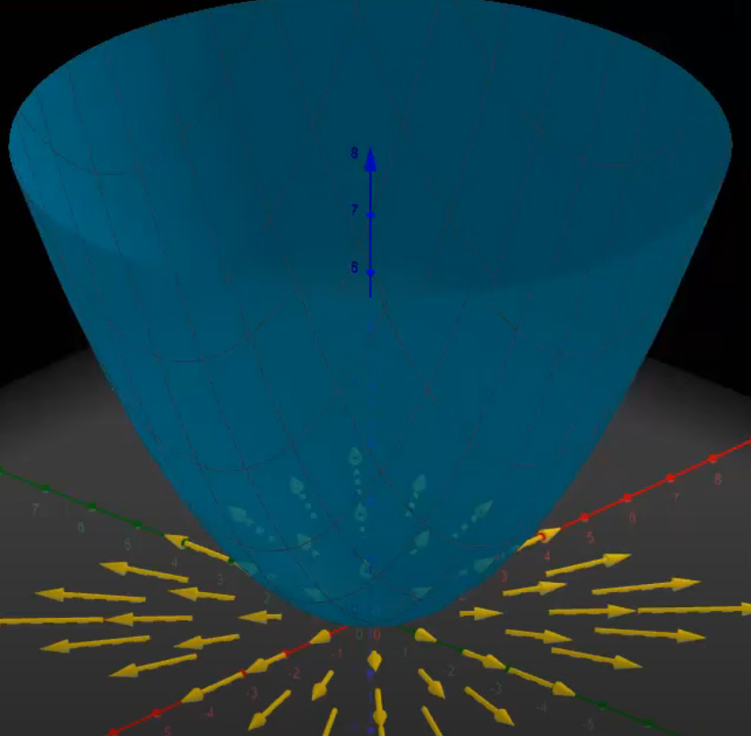
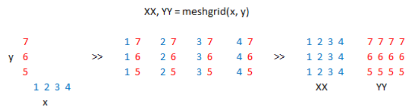
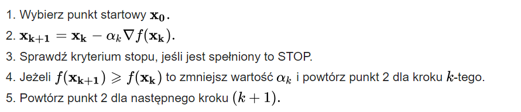
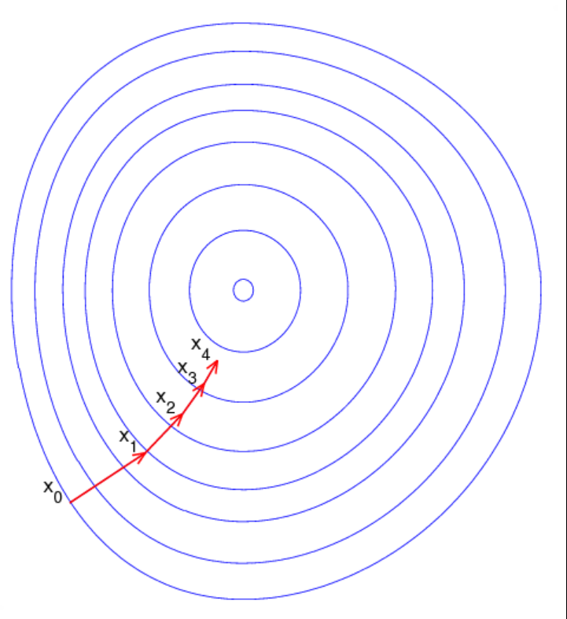

Podstawowe wiadomości przed wykonaniem zadania:

## Gradient

Gradient wskazuje kierunek najszybszego wzrostu funkcji.

Gradient funkcji to wektor, którego składowe to pochodne cząstkowe funkcji po wszystkich jej argumentach.

## Gradient przykład

Gradient w tym przypadku to żółte wektory, dla każdego punktu (x, y) jest przyporzadkowany wektor.
 

  

 
Długość wektora gradientu pokazuje nam jak bardzo jest stromo (czyli jak szybko powierzchnia w danym punkcie się wznosi)

## Numpy

- np.arange(-2, 2, 0.05) - zwraca symetrycznie rozłożone wartości z przedziału [-2, 2) oddalone o 0.05

- np.exp - zwraca wartość funkcji eksponencjalnej dla wartości lub tablicy wartości f(x) = exp(x) = e^x

- np.meshgrid - bierze dwie tablice i tworzy z nich grid, zwraca listę numpy.ndarrays  
  przykład:  
  xvalues = np.array([0, 1, 2, 3, 4])  
  yvalues = np.array([0, 1, 2, 3, 4])  
  xx, yy = np.meshgrid(xvalues, yvalues)  
  xx will be: [[0 1 2 3 4] [0 1 2 3 4] [0 1 2 3 4] [0 1 2 3 4] [0 1 2 3 4]]
   

  

    
  

   

## Matplotlib

- plt.contour - tworzy wykres konturowy (przedstawienie wykresu 3d na wykresie 2d)

- plt.scatter - do rysowania pojedynczych punktów na wykresie

## Dodatkowe informacje

- Pochodna jako współczynnik kierunkowy stycznej do funkcji w danym punkcie.
- W naszym przypadku będziemy badać funkcje R^2 -> R
- W przedstawionych wykresach konturowych zmieniające kolory pokazują większe/mniejsze wartości funkcji (na osi Z)
   

## Metoda gradientu prostego

- Metoda gradientu prostego jest iteracyjnym algorytem wyszukiwania
  <strong>minimum zadanej funkcji</strong>
- Metoda ta znanduje minimum lokalne, a nie koniecznie globalne. Jest ona skuteczna w znajdowaniu najniższego punktu w pewnym obszarze, ale nie gwarantuje znalezienia najniżeszego punktu na całym obszarze dziedziny funkcji.
- Jej wadą jest to, że przy funkcjach, które mają wiele minimów lokalnych, metoda gradientu prostego może utknąc w jednym z nich i nie znalźć globalnego minimum.
- Kierunkiem poszukiwań w metodzie gradientu prostego jest antygradient funkcji
- Współczynnik alpha jest współczynnikiem długości kolejnych kroków. W wielu przypadkach przyjmuje się stałe niewielkie wartości, przy testowaniu można zacząć od bardzo małych wartości
- f(x0) > ... > f(xk) > f(xk+1), powinny przyjmować coraz mniejsze wartości, jeśli tak nie jest to należy powrórzyć krok z mniejszą wartością alpha
- atrybut 'trace' to lista punktów po których się poruszaliśmy w trakcie wykonywania metody

 

 

## Działanie metody gradientu prostego

W każdej iteracji przechodzimy na punkt o niższej wartości funkcji.
 

  

 

## Funkcje do testów do przekopiowania

- f(x,y) = x^(2)+y^(2)

- f(x, y) = 1.5-e^(-x^(2)-y^(2))-0.5 e^(-(x-1)^(2)-(y+2)^(2))
