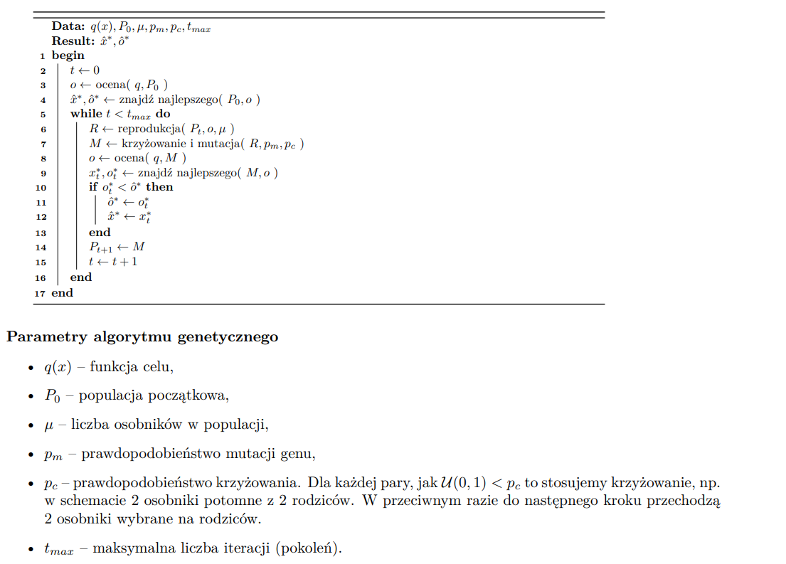

Podstawowe wiadomości przed wykonaniem zadania:

## Algorytm genetyczny

Algorytmy ewolucyjne są inspirowane ewolucją naturalną. Jeśli wykorzystują <strong>kodowanie
binarne</strong> to takie algorytmy nazywamy <strong>algorytmami genetycznymi</strong>.

## Ewolucyjne nazewnctwo

- Osobnik - reprezentuje punkt w przeszukiwanej przestrzeni
- Populacja - zbiór osobników przetwarzanych w każdej iteracji
- Mutacja - losowe zaburzenie zmiennych osobnika (<strong>genów</strong>), np. zmieniamy randomowy bit chromosomu (ma za zadanie wygenerować punkt z otoczenia punktu mutowanego), jego zadaniem jest trochę różnicować dobre rozwiązania
- Krzyżowanie - nowy osobnik powstaje na podstawie genów istniejących osobników (najczęściej dwóch), np. krzyżowanie jednopunktowe, gdy dzielimy chromosom w jednym punkcie i zamieniamy drugie częsci miejscami dostając dwóch nowych osobników (ma za zadanie wygenerować punkt pośredni pomiędzy rodzicami)
- Chromosom - wszystkie geny, najczęściej osobnik ma jeden chromosom (wartość można obliczyć np. przekształcając liczbę binarną genotypu na rzeczywistą bez ucinania poczatkowych zer w liczbie binarnej)
- Reprodukcja - proces tworzenia nowych osobników, potomostwa (ma za zadanie tworzenie potomostwa, w nadzei na znalezienie coraz lepszych rozwiązań problemu), proces opiera się na wyborze rodziców, krzyżowaniu i ewentualnej mutacji
- Selekcja - wybór najlepiej przystosowanych osobników do reprodukcji (chociaż przez nią spada coraz bardziej różnorodność chromosomów)

## Pseudokod

 

## Oczekiwany wynik

Na wykresie punkty powinny pojawiać się w różnych miejscach bliżej minimum. Nie powinna to być linia jak w przypadku minializacji metodą gradientu prostego. Celem jest znalezienie optymalnych rozwiązań w przestrzeni rozwiązań poprzez ewolucję populacji.

## Klasyczny algorytm genetyczy

- reprodukcja proporcjonalna - prawdopodobieństwo wyboru osobnika jest wprost proporcjonalne do wartości funkcji celu
- krzyżowanie jednopunktowe
- sukcjesja generyczna (stały rozmiar populacji)
- ważna jest funkcja celu q(x), która przypisuje ocene każdemu możliwemu rozwiązaniu/osobnikowi

## Klasyczny algorytm genetyczny - ustawienia

- rozmiar populacji powinien być duży, znacznie przewyższając liczbę możliwych rozwiązań (pomaga w eksploracji przestrzeni rozwiązań i zwiększa szanse na znalezienie lepszych rozwiązań)
- stosuje się duże prawdopodobieństwo krzyżowania i bardzo małe prawdopodobieństwo mutacji
- uważano, że głównym czynnikiem napędowym ewolucji jest krzyżowanie, przy czym nie powino ono niszczyć znalezionych schematów, w związku z tym krzyżowanie jednopunktowe uważane było za dobre (krzyżowanie równomierne - dla każdego genu losujemy, z którego rodzica będzie pochodził, było uważane za złe, bo gubi znalezione schematy)

## Selekcja turniejowa - metoda reprodukcji

- populacje dzieli się na szereg dowolnie licznych grup
- następnie najlepsze dwa osobniki z tych grup są wybierane, są to przyszli rodzice

## Oznaczenia w szkielecie implementacji

- Chromosome może mieć aktywne i nieaktywne geny - nieaktywne geny to taki, które nie mają wpływu na rozwiązanie oraz nie są brane pod uwagę w funkcji oceny
- aoi - Area of Interest - to zakres wartości, w którym dekodowane liczby rzeczywiste muszą się znajdować, jeśli aoi to <0, 1>, to po dekodowaniu chromosomu powiniśmy uzyskać liczbę z tego przedziału
