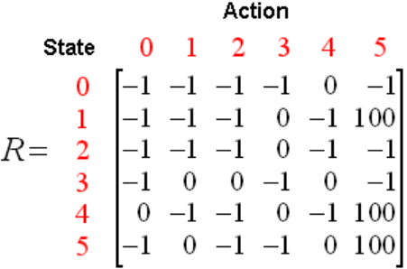

Podstawowe widomości przed wykonaniem zadania:

## Algorytm Q-learning ogólnie

- uczenie ze wzmocnieniem (reinforcement learning), jego zadaniem jest, aby agent podejmował dobre decyzje w środowisku, gdzie skutki ich działań są cześciowo losowe i częsciowo zależne od ich decyzji

## Tabela wartości Q



- potrzebna jest tabela wartości Q, która reprezentuje przybliżone oczekiwania nagród za wykonanie określonych działań w określonych stanach
- table ta jest inicjowana na początku uczenia się, a następnie jej wartości są stopniowo aktualizowane
- wartości Q są aktualizowane po każdej interakcji z otoczeniem (po wykonaniu akcji i otrzymaniu nagrody)

## Proces uczenia

- agent początkowo eskploruje środowisko, podejmując losowe decyzje, a z czasem zaczyna wykorzystywać swoją wiedzę, wybierając akcje maksymalizujące wartość Q
- na końcu procesu uczenia się w algorytmie Q-learning-u będziemy mieli pełną tablę wartości Q, z której będziemy mogli czytać najlepszą akcję w danym stanie

## Równanie Q-learning

- Q(s,a)=(1-α)\*Q(s,a)+α×(r+γ×max Q(s′, a′))
  s - stan,
  a - akcja,
  r - natychmiastowa nagroda,
  maxQ(s', a') - maksymalna przyszła nagroda
  α - współczynnik uczenia, czyli jak szybko aktualizowane są wartości w tabeli Q
  γ - wspólczynnik dyskontujący, który obniża wartość przyszłych nagród
- Q: s x a -> R

## Uwagi do startowego kodu

- observation_space - liczba różnych stanów
- action_space - liczba różnych akcji
- epsilon - wartość, która decyduje, jak często agent podejmuje losowe decyzje zamiast tych opartych na maksymalizacji Q-wartości (chodzi o eksploracje) - można na to patrzyć jak na prawdopodobieństwo

## Problem taxi

- pick-up and drop-off lokalizację są zaznaczone jako Red, Greeen, Yellow, Blue
- taxi i pasażer zaczynają w którymś z tych miejsc
- celem jest odebranie pasażera, zawiezienie go na miejsce docelowe i wysadzenie pasażera
- nagroda za dowiezienie pasażera +20
- kara za nielegalne odebranie/wysadzenie pasażera -10
- kara za ruch, gdy nie ma innej nagrody -1
- ten problem działa na gridzie 5x5
- zakodowany stan w tym problemie ma wartości od 0 - 499, są to wszystkie możliwości położenia taksówki, pasażera i celu podróży
- co zawiera słownik 'info':
- action_mask wskazuje jakie akcje są dostępne w danym stanie np. 'action_mask': array([1, 1, 1, 0, 0, 0], dtype=int8), oznaczają kolejno ruch na południe, północ, wschód, zachód, zabranie pasażeram wysadzenie pasażera, 1 oznacza że akcje jest możliwa, 0 że nie
- prob: 1 oznacza, że operujemy na środowisku deterministycznym, jak jesteśmy w danym stanie i wykonamy dany ruch to zawsze trafimy do jakiegoś określonego nowego stanu
- jeśli nie ustawimy max_episode_steps w gym.make to nie musimy się martwić o wcześniejsze zakończenie

## Przykład wizuliacji problemu Taxi, do którego trzeba dodać algorytm Q-learning

```
import gymnasium as gym
import pygame
import numpy as np

env = gym.make('Taxi-v3', render_mode="human", max_episode_steps=15)
starting_state = env.reset()

if_finished = None
if_truncated = None
info = None
while not if_finished and not if_truncated:
env.render()
if not info:
action = np.random.choice((np.where(starting_state[1]['action_mask'] == 1))[0])
else:
action = np.random.choice((np.where(info['action_mask'] == 1))[0])

    next_state, reward, if_finished, if_truncated, info = env.step(action)
    print("Aktualnie można wykonać akcje: " + str(info['action_mask']))
    pygame.time.delay(2_000)

env.render()
env.close()
```
