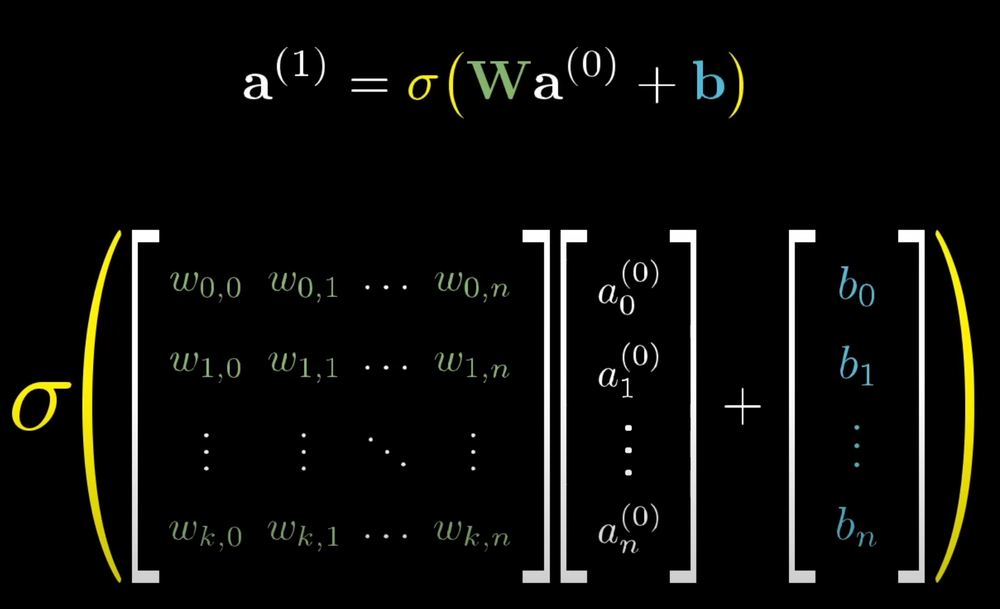
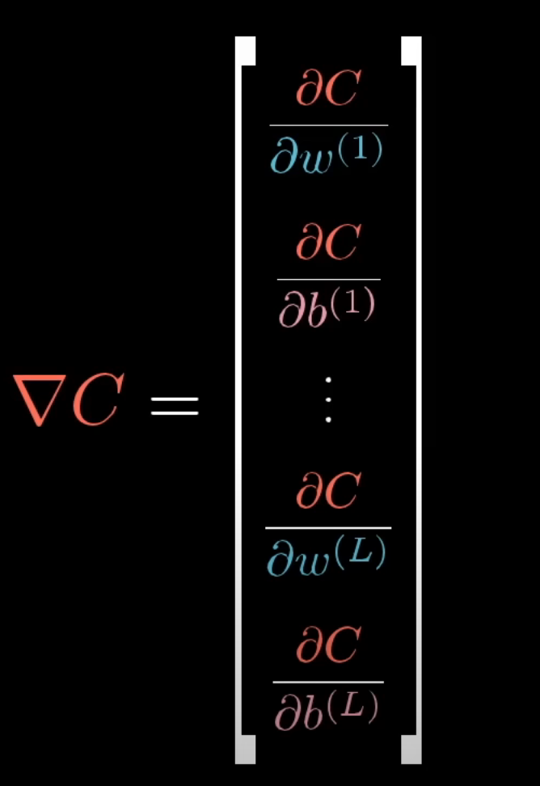
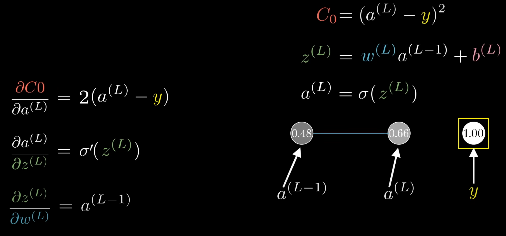

Podstawowe wiadomości przed wykonaniem zadania:

## Warstwy

Dany wektor obrazujący liczbę przechodzi przez kilka wartstw.
Dane na jednej warstwie powodują jakiś wzór na kolejnej i tak dalej i tak dalej.
Na końcu otrzymujemy końcową kwalifikację, która jest wybiarana na podstawie najwyższego prawdopodobieństwa (prawdopodobieństwo określa jak nasz model jest pewny, że jest to dana liczba)

## Wagi i funkcja aktywacji

Każdy neuron jest połaczony jakąs wagą z neuronem z kolejnej warstwy.
Obliczamy ważoną sumę i przekształcamy ją na wartość z zakresu <0, 1> za pomocą funkcji aktywacji np. Sigmoid

Suma ważona określa jakiś konkretny wzór.
Można dodać bias, żeby opóźnić moment aktywacji neuronu.

---

Jak szybko otrzymać wektor wartości neuronów na kolejnej warstwie:


np. w(k,n) - waga neuronu nr. n idącego do neuronu nr. k w nastepnej warstwie

## Na czym tutaj polega uczenie się

Polega na odpowiednim doborze wag wchodzących do neuronu i jego bias i tak dla każdego neuronu.

Wiemy jakie wartości chcielibyśmy uzyskać, liczymy sumę kwadratów różnic tego co nam wyszło w końcowym neuronie i tego co powiniśmy uzyskać.

Jeśli suma jest duża to idziemy w złym kierunku, jeśli jest mała to znaczy, że jest bardzo dobrze.

W procesie trenowania sieci neuronowej celem jest minimalizacja średniej wartości wartoścji funkcji kosztu obliczonej dla wszystkich przypadków w zbiorze treningowym.

## Gradient descent

Jest używany to minimalizacji funkcji kosztu (im mniejsza, tym bliższy wyników oczekiwanemu).

Tak jak w zadaniu kiedyś tam, po prostu znajdujemy lokalne minimum przy pomocy gradientu (kierunek najszybszego wzrostu) - tylko w tym przypadku będziemy mieli dużo więcej wymiarów.

Zmieniamy wektor wag i biasów, na wektor wag można patrzeć na to jak ważna jest dana waga. Chcemy uzyskać taki wektor, aby średnia funkcja kosztu była najmniejsza.

## Propagacja wsteczna

Polega na przekazywaniu błędu z wyjścia sieci do jej kolejnych warstw w odwrotnej kolejności, umożliwiając aktualizację wag w sposób obniżający wartość funkcji kosztu.

## Wektor gradientu funkcji kosztu - pochodne



Pochodne cząstkowe mówią o tym jak zmiany w tym co jest na dole, wpływają na funkcję kosztu C. Określają jaki wpływ mają wagi na błąd popełniany przez sieć neuronową.



W taki sposób możemy obliczyć jak dana waga wpływa na przyszły wynik funkcji kosztu patrząc na wpływ wartości przyszłego neuronu, z którym mamy połączenie, na funkcje kosztu.

## Zbiór MNIST

Przykład jak on wygląda

```
from sklearn.datasets import load_digits
import matplotlib.pyplot as plt

digits = load_digits()
plt.matshow(digits.images[20])
print(digits.data[20])
print(f"It is a number: {digits.target[20]}")
plt.gray()
plt.show()
```

Nasze dana to macierze 8x8 z wartościami pikseli (my będziemy korzystać z wektorów jednowymiarowych 64 wartościowych - digits.data), oraz przypisane
im wartości liczbowe, od 0 do 9 - digits.target

Zawiera on 1797 obrazów, a każdy obraz to wektor 64 wartości. Każdy
obraz to jakaś liczba zapisana za pomocą pikseli.

Pojedynczy piksel przybiera wartości od 0 do 16 - lepiej jest te wartości zmienić na wartości z zakresu <0; 1>

### Porównanie co najmniej dwóch architektur sieci

Tutaj chyba będzie chodziło o np. zmianę liczby neuronów w wartstwach albo o zmianę funkcji aktywacji (jeśli zmieniasz funkcje aktywacji to zmieniasz 'typ' neuronu) i wtedy porównujesz wyniki i sprawdzasz, która architektura sieci daje lepsze wyniki licząć accuracy.
np. Sigmoid, ReLU

## Testowanie sieci neuronowej

Uczysz sieć neuronową na danych treningowych np. 80% zbioru, a na pozostałej części - zbiorze testującym, sprawdzasz accuracy.

## Ważne dla debuggowania

GDY MOŻNA ZROBIC AxB NA MACIERZACH TO:
LICZBA KOLUMN MACIERZY A JEST RÓWNA LICZBIE WIERSZY MACIERZY B
